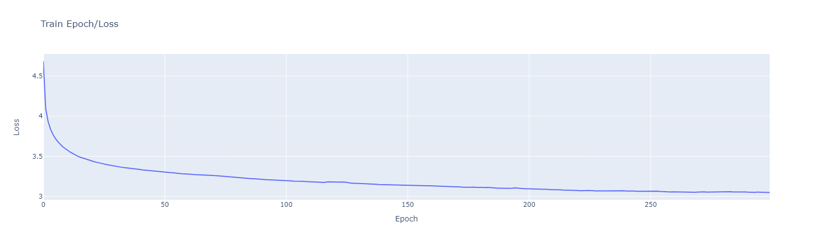

# Attention Is All You Need

My silly transformer implementation with my silly little comments. I've implemented a vanilla transformer from the original 2017 paper ['Attention Is All You Need'](https://arxiv.org/pdf/1706.03762) (with small differences, though). Feel free to use it however you like; the repository distributes under the MIT License.

The implementation uses Hugging Face 🤗 libraries (datasets, tokenizers, evaluate), and PyTorch + CUDA to make things move. No deprecated dependencies (at least for now!). No unnecessary file divisions.

The only important difference between the implementation and the paper is the warmup scheduling (cosine instead of what's described in the paper). It's easy to add the original warmup to the program, but for me, it doesn't make sense - it's hard to use for small datasets, and I can't use a large one because of my limited computational resources.

The implementation uses a 'greedy decoding' strategy (picking a token with the highest probability). You can implement something more flexible to have a wider range of outputs from the model.

# Datasets

Out of the box, the implementation can employ the following datasets:

- [wmt/wmt14](https://huggingface.co/datasets/wmt/wmt14)
- [benjaminbeilharz/daily_dialog_w_turn_templates](https://huggingface.co/datasets/benjaminbeilharz/daily_dialog_w_turn_templates)
- [goendalf666/sales-conversations](https://huggingface.co/datasets/goendalf666/sales-conversations)
- local-merge/sales-dailydialog (merge of the two above)

You can easily add a new one.

# Use

The number of epochs necessary for transformer training is usually large. For the 'local-merge/sales-dailydialog' dataset, I used 300 epochs, which took 14 hours on my RTX 2060. More training examples ([1](https://github.com/karpathy/nanoGPT), [2](https://github.com/Adityarajora/All-new-projects/blob/master/Chatbot_transformer/transformer_model.ipynb)).



## Train
Train:
```bash
python train.py --n=2 --d-model=256 --d-ff=512 --h=8 --p-drop=0.1 \
    --dataset-name=local-merge/sales-dailydialog \
    --epoch=300 --batch-size=32 --e-ls=0.1 --save-every-n-epoch=20 --warmup-steps=200
```

Train from checkpoint:
```bash
python train.py --n=2 --d-model=256 --d-ff=512 --h=8 --p-drop=0.1 \
    --dataset-name=local-merge/sales-dailydialog \
    --epoch=300 --batch-size=32 --e-ls=0.1 --save-every-n-epoch=20 --warmup-steps=200 \
    --load-from=./saves/FILE_NAME.pb
```

## Test
Want to get model's metrics? Test it!
```bash
python test.py --dataset-name=local-merge/sales-dailydialog --batch-size=32 --e-ls=0.1 \
    --model-path=./saves/FILE_NAME.pb
```

## Inference
```bash
python inference.py --max-seq-len=40 --dataset-name=local-merge/sales-dailydialog \
    --model-path=./saves/FILE_NAME.pb
```
